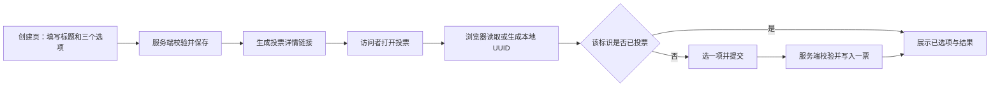
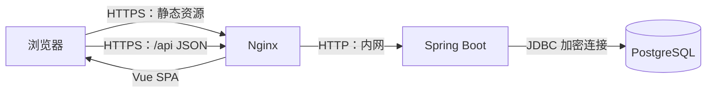

 # 匿名投票系统设计方案（前后端分离）

> 状态：待确认；本文是实施方案，不包含业务代码。  
> 范围假设：用户可创建多条投票；每条投票有一个标题和**恰好三个**选项；创建者和投票者均无需登录。若只需要一条预设投票，可在实施前收窄范围。

## 1. 目标与验收标准

创建者填写标题和三个选项，提交后得到可分享的投票链接。访问者打开链接后，选择一个选项并投票；页面展示三个选项的票数、百分比和进度条，并显示总票数。

验收标准：

1. 标题和三个选项都不能为空；选项必须恰好三个，去掉首尾空格后不能重复。
2. 同一个浏览器标识对同一条投票最多产生一条有效记录；对不同投票可分别投票。
3. 投票成功后立即更新结果；刷新页面后结果和“已投票”状态仍正确。
4. 两个请求同时使用同一标识投同一条投票时，数据库中仍只有一票。
5. 0 票时显示 `0 票 / 0%`，进度条为空；数据读取失败时提供重试入口。
6. 手机和桌面浏览器都可使用，键盘可操作，票数不只靠颜色表达。

## 2. 用户流程



- 创建页 `/polls/new`：标题、三个固定输入框、创建按钮；创建成功跳转到详情页。
- 详情页 `/polls/{id}`：标题、三个单选项、提交按钮、总票数、每项票数/百分比/进度条。提交期间禁用重复点击。
- 结果对所有访问者可见，未投票者也可查看。页面建立 SSE 长连接；任一投票变化后，其他在线页面自动读取最新结果，无需手动刷新。SSE 不可用时，页面处于可见状态会约每 15 秒更新一次结果。
- 一票提交后仍可更改选项。相同选项重复提交返回已有结果且不增加票数；改选其他选项时更新原投票记录，总票数不变。

## 3. 完整技术栈

| 层次 | 技术 | 用途与选择理由 |
| --- | --- | --- |
| 前端语言与框架 | TypeScript、Vue 3、Composition API | Vue 负责页面交互；Composition API 是 Vue 组织组件状态和逻辑的标准方式，适合把投票状态、请求状态拆分为可复用模块。 |
| 前端工程 | Vite、Vue Router、Pinia | Vite 负责开发服务器和生产构建；Vue Router 管理创建页、详情页等浏览器路由；Pinia 只存放跨组件状态。 |
| 前端样式 | Tailwind CSS + 少量原生 CSS | 实现响应式页面、加载和错误状态，进度条保留文字信息。 |
| 前端请求与校验 | Fetch API 封装、Zod | 统一处理 API 地址、超时、错误响应；Zod 用于校验服务端返回结构，避免接口变更悄悄造成错误页面。浏览器校验不能替代后端校验。 |
| 后端语言与框架 | Java 17 LTS、Spring Boot 3.5.x、Spring Web MVC | Java 17 是长期支持版本；Spring Boot 提供可直接部署的 HTTP 服务，MVC 负责接收 REST API 请求、调用业务层并返回 JSON。选择当前成熟维护线 3.5.x，精确补丁版本在初始化时锁定；可在后续无业务代码变更的情况下升级至 Java 21。 |
| 后端分层 | Controller、Service、Repository、DTO | Controller 处理 HTTP；Service 承载投票规则和事务；Repository 访问数据库；DTO（数据传输对象）限定 API 的请求/响应结构，避免直接暴露数据库实体。 |
| 数据校验与错误处理 | Jakarta Bean Validation、`@ControllerAdvice` | Bean Validation 用注解校验标题长度、UUID 等输入；`@ControllerAdvice` 集中输出统一错误 JSON，避免每个接口重复处理异常。 |
| 数据库 | PostgreSQL 17 | 持久保存投票和投票记录，靠唯一约束保证并发下不重复计票；与当前 Flyway 版本的正式支持范围匹配。 |
| 数据访问与迁移 | Spring Data JPA / Hibernate、Flyway | JPA 将 Java 实体映射到关系数据库表；Flyway 用版本化 SQL 文件变更数据库结构，并在部署时记录已执行迁移。涉及高并发投票的插入使用明确 SQL 和数据库约束，不依赖 ORM 的“先查询后写”。 |
| 构建与依赖管理 | Maven Wrapper | Maven 统一下载和构建 Java 依赖；Wrapper 固定 Maven 版本，使开发和 CI 环境一致。 |
| 测试 | JUnit 5、Spring Boot Test、Testcontainers、Vitest、Playwright | JUnit 测后端规则；Testcontainers 在测试时启动真实 PostgreSQL，验证唯一约束和并发；Vitest 测前端逻辑；Playwright 测浏览器完整流程。 |
| 开发与部署 | Docker Compose；Nginx；Docker 镜像；托管 PostgreSQL | 本地一键启动前端、后端和数据库；生产中 Nginx 提供 HTTPS、静态前端文件和 `/api` 反向代理，前后端保持独立构建与部署。 |
| 质量检查 | Checkstyle、SpotBugs、ESLint、TypeScript 类型检查、CI | 检查代码风格、常见缺陷、前端类型以及构建测试。CI 指持续集成，即每次提交自动执行这些检查。 |

不需要 Redis、消息队列或实时推送：目前结果可通过普通 HTTP 查询更新，系统规模和功能不足以支撑额外组件的运维成本。前端依赖的精确版本写入 `package-lock.json`，后端依赖由 Maven 的依赖锁定策略和构建文件管理，避免设计阶段写死会变化的补丁版本。

### 前后端边界



SPA 是单页应用：Vue 首次加载后在浏览器内切换页面，不会每次跳转都从后端重新生成 HTML。生产环境中前端仅调用同域的 `/api`，由 Nginx 转发给后端，因此通常不需要 CORS（跨域资源共享）配置；本地开发时 Vite 同样代理 `/api` 到 Spring Boot，保持调用方式一致。

## 4. 数据结构

### Poll（投票）

| 字段 | 含义 |
| --- | --- |
| `id` UUID，主键 | 投票公开链接中的标识 |
| `title` VARCHAR(200)，非空 | 投票标题 |
| `created_at` 时间 | 创建时间 |

### Option（选项）

| 字段 | 含义 |
| --- | --- |
| `id` UUID，主键 | 选项标识 |
| `poll_id` UUID，外键 | 所属投票 |
| `label` VARCHAR(100)，非空 | 选项文字 |
| `position` SMALLINT | 显示顺序，取 1、2、3 |

对 `(poll_id, position)` 建唯一约束。服务端创建投票时在同一数据库事务中写入 Poll 和三个 Option，并校验选项数量。

### Vote（投票记录）

| 字段 | 含义 |
| --- | --- |
| `id` UUID，主键 | 记录标识 |
| `poll_id` UUID，外键 | 所属投票 |
| `option_id` UUID，外键 | 所选选项 |
| `visitor_key` VARCHAR(64) | 服务端计算的匿名标识摘要 |
| `created_at` 时间 | 首次投票时间 |
| `updated_at` 时间 | 最后一次改投时间 |

对 `(poll_id, visitor_key)` 建**复合唯一约束**，即这两个字段的组合不能重复。这是“一条投票一次”的最终保证，不能只靠按钮禁用或先查后写。服务端还需确认 `option_id` 确实属于 `poll_id`。每次读取结果时按选项聚合 Vote 表，补齐 0 票选项；初期不存冗余票数，避免重复计数。

## 5. 匿名标识与计票规则

1. 浏览器首次访问时调用 `crypto.randomUUID()` 生成随机 UUID，存入本站域名下的 `localStorage`。`localStorage` 是浏览器保存少量本地数据的空间，关闭页面后仍会保留；UUID 是随机生成、碰撞概率很低的标识。正式环境使用 HTTPS。
2. 投票请求携带该 UUID。服务端验证其格式，再用服务端密钥计算 HMAC-SHA-256 摘要并保存为 `visitor_key`，数据库不直接保存浏览器原始标识。HMAC 是带密钥的哈希计算；这里用来降低数据库泄露时原标识直接暴露的风险，不提供真实身份认证。该密钥须稳定保存，轮换需要专门迁移方案。
3. 同一标识再次提交同一选项时返回先前结果，不增加票数，便于网络失败后的安全重试；提交不同选项时更新原记录的选项和更新时间，始终只保留一票。
4. 用户清除本地存储、换浏览器或主动伪造标识，可以再次投票。这符合“不登录、不防刷”的要求；结果只能表示**按浏览器标识统计的票数**，不能宣称唯一自然人数。
5. 页面不在 URL 中传播访问者标识；服务端日志不记录原始标识。创建和投票接口仍需请求体大小限制、字段长度限制和错误处理，以避免无意的超大输入拖垮服务；这些属于基本稳定性措施，并非防刷。

## 6. HTTP 接口

| 方法与路径 | 请求 | 成功响应 | 主要错误 |
| --- | --- | --- | --- |
| `POST /api/polls` | `title`, `options: [文本, 文本, 文本]` | 201：`id`, `url` | 400：字段不合法 |
| `GET /api/polls/{id}` | 无 | 200：标题、三个选项、创建时间 | 404：不存在 |
| `GET /api/polls/{id}/results` | 可选访问者标识，通过请求头发送 | 200：总票数、每项票数和百分比、该标识已选选项 | 404：不存在 |
| `GET /api/polls/{id}/events` | 无 | SSE：`results-updated` 结果更新事件 | 404：不存在 |
| `POST /api/polls/{id}/votes` | `optionId`, `visitorId` | 201：首次投票及最新结果；同选项重试或改投均为 200 | 400：参数不合法；404：投票或选项不存在 |

接口返回统一错误结构 `{ code, message }`，便于 Vue 的请求模块显示可读提示。结果接口禁用共享缓存，避免票数滞后或把一个访问者的“已选选项”返回给其他访问者。SSE 只发布投票 ID 和更新信号，前端收到后独立请求结果，不能通过事件看到其他访问者的选择。浏览器断网后 SSE 自动重连；`online` 事件会立即触发一次结果读取。结果百分比按 `票数 / 总票数 × 100` 计算，0 票为 0%；各项独立四舍五入后，显示百分比总和可能是 99% 或 101%，不影响票数真实性。

## 7. 页面与交互细节

- 标题最大 200 字，选项各最大 100 字；保存前去首尾空格；拒绝空白内容与重复选项。
- 单选按钮使用原生表单语义；结果同时显示数字和进度条，并提供屏幕阅读器可读的文本。
- 投票提交时显示加载状态；只有收到成功响应后才显示“已记录”。请求失败时保留当前选择并显示未保存状态，网络恢复后自动读取服务端结果，用户可再次提交。
- 显示实时同步状态；断网时提示结果可能已过期，恢复网络后自动重新同步。
- 本地标识读写失败时明确提示浏览器存储不可用，不提交一个临时标识造成刷新后状态丢失。
- 不允许标题或选项作为 HTML 执行；以普通文本渲染，避免脚本注入。

## 8. 目录规划

```text
vote/
  frontend/
    src/
      views/                    # 创建页、详情页
      components/               # 表单、投票卡片、结果进度条
      router/                   # Vue Router 路由定义
      services/                 # API 请求封装
      stores/                   # Pinia 状态
      utils/visitor-id.ts       # 浏览器标识读写
    vite.config.ts              # 本地 /api 代理
  backend/
    src/main/java/.../
      controller/               # REST API
      service/                  # 投票规则与事务
      repository/               # 数据库访问
      entity/                   # JPA 实体
      dto/                      # 请求/响应对象
      config/                   # HMAC、异常处理等配置
    src/main/resources/
      db/migration/             # Flyway SQL 迁移文件
      application.yml           # 非敏感环境配置
    src/test/                   # 单元、集成和并发测试
  deploy/
    nginx/                      # 反向代理配置
    docker-compose.yml          # 本地开发编排
  e2e/                          # Playwright 浏览器流程测试
```

## 9. 上线与验证

实施顺序：初始化前端、后端与数据库结构 → 后端创建投票接口 → 后端投票及结果接口 → Vue 创建与详情页面 → 匿名标识和结果展示 → 测试、镜像构建和部署说明。生产部署先备份数据库，再由 Spring Boot 启动阶段执行已审查的 Flyway 迁移，最后使新后端实例接收流量；数据库连接信息和 HMAC 密钥放在部署环境的密钥配置中，不提交到仓库。

重点测试：创建输入边界、选项是否属于投票、0 票/多票百分比、同标识重复请求、同标识改投后总票数不变、并发重复提交、两个标识分别投票、SSE 通知后另一浏览器自动刷新结果、断网恢复后的重新同步、提交失败不显示成功、清除本地标识后的行为、刷新后的已投票状态、移动端和键盘交互。发布门槛为类型检查、静态检查、测试与生产构建通过。

## 10. 待确认的产品选择

1. 当前按“可创建多条投票”设计；若只需要**一条预设投票**，可去掉创建页和创建接口。
2. 当前创建者也无需登录，因此任何人都能创建投票。若投票创建权需要控制，需要额外定义管理员身份或部署层访问限制。
3. 当前允许所有人投票前查看结果，投出后允许改选，且每名匿名访问者始终只有一票。若希望“投票后才显示结果”，页面和接口规则需要相应调整。

## 参考资料

- [Spring Boot 官方文档](https://docs.spring.io/spring-boot/)
- [Vue 3 官方介绍](https://vuejs.org/guide/introduction)
- [Vite 官方文档](https://vite.dev/guide/)
- [PostgreSQL 版本支持政策](https://www.postgresql.org/support/versioning/)
- [MDN `crypto.randomUUID()` 文档](https://developer.mozilla.org/en-US/docs/Web/API/Crypto/randomUUID)
- [Playwright 官方文档](https://playwright.dev/docs/intro)
